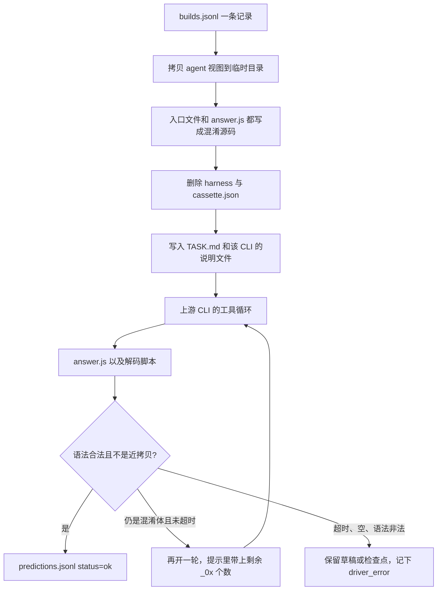

# Baseline agent 实际执行原理

本文说明当前仓库里各 baseline 在一次样本上到底做了什么。依据是 `baselines/*/run.py`、`baselines/*/worker.py` 和对应的 `prompt.txt`，配置默认值取自各目录的 `config.example.json`。

带工具循环的 baseline 有五个，它们共用同一套沙箱构造，差别在上游 CLI、协议和护栏：

| Baseline | 上游 CLI | 模型看到的协议 | 产物 |
| --- | --- | --- | --- |
| `claude_code` | `claude --print` | Anthropic Messages | `answer.js` |
| `codex` | `codex exec` | OpenAI Responses | `answer.js` |
| `opencode` | `opencode run` | OpenAI Chat Completions | `answer.js` |
| `openhands` | `openhands --headless` | LiteLLM → Chat Completions | `answer.js` |
| `kimi_code` | `kimi -p` | OpenAI Chat Completions | `answer.js` |

另外三个 baseline 没有 agent 循环，见文末：`L0` 是单次补全，`static_tools` 是确定性反混淆器，`jsimplifier` 是无模型的 AST 流水线。

模型始终看不到干净源码、项目测试、oracle 和评分。评分只发生在 agent 退出之后，由 `evaluators/score.py` 读取 `predictions.jsonl`。

## 一次样本怎么跑

五个 CLI baseline 的 `run.py` 形状相同。对 `builds.jsonl` 里的一条 build：

1. 用 `subject_id` 找到 `sandbox/stats/sandboxes.json` 里登记的沙箱，读 `agent/sandbox.json` 得到入口文件名（`subject.mjs` 或 `subject.cjs`）。
2. 把 `agent/` 整棵拷到临时目录。混淆后的源码写回入口文件，同时再写一份到 `answer.js`，作为语法合法的安全草稿。
3. 删掉 `harness/` 和 `cassette.json`。agent 因此不能使用执行/调试 harness，也拿不到录制好的时钟、随机数和网络。剩下的是入口文件、`package.json`、依赖符号链接，以及后面写进去的任务文件。
4. 父进程把任务 JSON 交给对应 `worker.py` 的 `process_task`。worker 写任务说明、隔离 CLI 的 home、拉起上游 CLI，并在墙钟超时后杀掉整个进程组。
5. 从磁盘上的 `answer.js` 收结果（必要时用检查点里的 `best_answer.js`）。`node --check` 只判断语法，不执行程序。
6. 写出 `outputs/<build_id>.js`、`transcripts/<build_id>.json` 和一行 `predictions.jsonl`，然后删掉临时工作区。检查点目录留在结果旁边，供 `--resume` 使用。

混淆源码不放进提示词。`prompt.txt` 里的 `{entry}` 只替换成文件名，`{source}` 被替换成空串。模型必须用 bash / Node 去读磁盘上的文件。

任务说明要求模型先写 `_decode.mjs` 抽出字符串表到 `decoded.json`，再改写 `answer.js`。提示里明确禁止 `import` 或直接执行入口文件：这些样本带反调试和死循环。也禁止访问网页、GitHub、npm 和上游仓库。

`answer.js` 里那份混淆草稿只是崩溃垫。收尾时如果正文仍是输入本身，来源标成 `input_fallback`，状态是 `timeout` 或 `empty_response`，不会记成 `ok`。近拷贝（只在前面加了注释，或正文几乎整段嵌在答案里，或多于等于 30 个混淆器自己的 `_0x` 标识符）标成 `under_deobfuscated`。默认最多再跑一轮；第二轮的提示会写明还剩多少个 `_0x` 名字，并要求接着用工作区里已有的解码脚本和 `CHECKPOINT.md`。墙钟超时会打断续跑。

除 OpenCode 外，worker 大约每 10 秒把工作区里的 `answer.js`、`CHECKPOINT.md`、`decoded*` 和 `_*.mjs` 拷到检查点目录（单文件上限 2MB），并单独保存最近一次 `node --check` 通过的 `best_answer.js`。最终 `answer.js` 不合法时，收集逻辑退回这份检查点。`--resume` 会在重试前把这些文件拷回新的临时工作区。

示例配置里单样本墙钟是 1200 秒，bash 超时是 120000 毫秒。Claude Code 在配置没写 `timeout_seconds` 时回退到 600 秒，示例配置本身写的是 1200。`max_passes` 缺省为 2。

## Claude Code

入口是 `claude --print`，输出 `stream-json`。权限模式是 `bypassPermissions`，并带 `--dangerously-skip-permissions`。会话不落盘（`--no-session-persistence`），slash command 关闭。

允许的工具是 `Read`、`Glob`、`Grep`、`Edit`、`Write`、`Bash`。`WebFetch` 和 `WebSearch` 在设置和命令行里都被拒绝。工作区说明写在 `TASK.md` 和 `CLAUDE.md`。真正发给 CLI 的那句话更短：读 `TASK.md`，用 bash/Node 切片加载入口文件，不要对那一行长文件使用 Read（整行会贴进下一次请求），不要执行入口文件，解码脚本的 `timeout_ms` 用配置里的 bash 预算。

协议是 Anthropic Messages。OpenRouter 的根是 `https://openrouter.ai/api`，CLI 自己拼 `/v1/messages`。Sophnet 的 Chat Completions 地址会被改写成 `https://www.sophnet.com/api/open-apis/anthropic`。密钥放进 `ANTHROPIC_AUTH_TOKEN`，并清掉 `ANTHROPIC_API_KEY`，避免本机残留的官方密钥抢路由。`HOME` 固定到 `~/.cache/adb-claude-home`（可用 `ADB_CLAUDE_HOME` 改），用户自己的 `~/.claude/settings.json` 不参与。

Opus / Sonnet / Haiku / Fable / 子 agent 的别名全部钉在同一条网关模型上。示例配置把这些别名指到 `openai/gpt-5.6-sol`，这样 CLI 内部偷偷换小模型时仍然打到同一个端点。

反调试有三层，不只靠提示词：

- `BASH_DEFAULT_TIMEOUT_MS` 和 `BASH_MAX_TIMEOUT_MS` 都设成 bash 预算。`BASH_MAX_OUTPUT_LENGTH` 默认 8000，避免把整张字符串表贴进下一轮。
- `PATH` 最前面放一个 `node` 包装器。`node -e` / `--eval` 直接拒绝；命令行里出现 `subject.mjs` 或 `subject.js` 也拒绝。其余 `node` 进程套 `timeout --kill-after=2`。包装器放行 `claude` 自己的脚本，CLI 启动时再用真实 `node` 解释器，避免包装器把会话本身杀掉。
- 另一个包装器拒绝 `find /`。

`API_TIMEOUT_MS` 默认 180000。示例配置把 `max_thinking_tokens` 设为 0：Claude Code 会把这个预算也用在隐藏的 bash 预检请求上，设大了会长时间没有 `answer.js`。`max_output_tokens` 为 32768 时导出 `CLAUDE_CODE_MAX_OUTPUT_TOKENS`。

Sophnet 上的非 Claude 模型默认会思考，而 Messages 模式没有关闭开关。driver 会在本机起一个 Anthropic 代理，只在 `/v1/messages` 上注入 `thinking: {"type": "disabled"}`，`count_tokens` 原样转发。代理强制 `Connection: close`，否则流式响应会一直等到 API 超时。

运行中 driver 读 stream-json，区分模型生成、工具调用和 bash 预检。墙钟到点就 `SIGKILL` 整个进程组，已经写好且语法合法的 `answer.js` 仍然可以收成结果。

## Codex

入口是 `codex exec --json --ephemeral`。沙箱模式 `workspace-write`，审批策略 `never`，工作区网络关闭，`web_search` 设为 `disabled`。`browser_use`、`browser_use_external`、`computer_use` 用 `--disable` 关掉。工作区写 `TASK.md` 和 `AGENTS.md`，并 `git init` 做一次初始提交。

协议是 Responses，不是 Chat Completions。`CODEX_HOME` 指向 `~/.cache/adb-codex-home`，里面的 `config.toml` 把 `model_providers.<provider>.wire_api` 设成 `responses`。OpenRouter 根是 `https://openrouter.ai/api/v1`。Requesty 必须用 `openai-responses/` 前缀，并关掉 reasoning summary，否则网关会拒字段。密钥从配置、环境变量或用户的 `~/.codex/auth.json` 读入，写到隔离 home 的 `auth.json`。

Codex 没有 Claude 那种 `node` 包装器。反调试靠提示词和 Codex 自己的命令超时：提示要求解码脚本把 `timeout_ms` 设成 bash 预算，不要再套一层 2 到 5 秒的 `timeout`。死循环若超出 CLI 的命令超时，应作为工具错误回到模型，而不是吃掉整段墙钟。

续跑、近拷贝判定和每 10 秒检查点与 Claude Code 相同。`config.toml` 用原子替换写入，避免并发 worker 读到半截文件。

## OpenCode

入口是 `opencode run --format json`。模型 id 形如 `openrouter/openai/gpt-5.6-sol`。`--file=<入口文件>` 必须写成等号形式，否则 CLI 会把后面的任务句子当成另一个文件路径。

工作区里的 `opencode.json` 覆盖默认 build agent。默认 agent 提示是通用软件工程循环，实测会把预算花在写 RC4 测试装置上；这里改成只做反混淆，并写明 Read 会把每一行截到 2000 字符，所以不能用 Read 加载入口文件。`steps` 限制工具步数，示例配置是 64，代码里夹在 4 到 64。单步输出上限取 `max_output_tokens`，再夹到 16384–65536。thinking 默认 `{"type": "disabled"}`。

权限：`bash` 允许；`external_directory`、`task`、`webfetch`、`websearch`、`codesearch` 拒绝。网关用 `@ai-sdk/openai-compatible`，`baseURL` 是 `/v1` 根，SDK 自己拼 `/chat/completions`。

`HOME` 复用一个缓存目录，避免每个样本重装 provider。`XDG_DATA_HOME` 放在该样本工作区的 `.adb-home` 里。bash 超时通过 `OPENCODE_EXPERIMENTAL_BASH_DEFAULT_TIMEOUT_MS` 和 `OPENCODE_BASH_TIMEOUT` 传给 CLI。

OpenCode 的 `process_task` 不做 `git init`，运行中也不写检查点。续跑只发生在同一次 `process_task` 里：第一轮结束时若 `answer.js` 仍判定为混淆体且没有墙钟超时，用同一工作区再启动一次 CLI。JSON 事件要等一个工具或文本片段结束才刷出，所以日志里的 quiet 时间不等于网关卡死。

`--finalizer` 默认关闭。打开后，仅当 agent 没留下任何代码时，才用 L0 的 Chat Completions 再请求一次：用户消息里是截断后的源码加上轨迹最后一段笔记，要求只返回一个程序。成功时 `answer_source` 记为 `finalizer`，和 CLI 自己写出的 `answer.js` 分开。

## OpenHands

入口是 `openhands --headless --json --override-with-envs --exit-without-confirmation --always-approve`。没有 `--override-with-envs` 时，CLI 会忽略环境变量，去读用户的 `~/.openhands/settings.json`。

`HOME` 是 `~/.cache/adb-openhands-home`。里面写入 `agent_settings.json`、`settings.json`、空的 `mcp.json`，以及 `cli_config.json`（`critic` 关闭）。环境变量 `LLM_MODEL`、`LLM_BASE_URL`、`LLM_API_KEY` 指向 LiteLLM。OpenRouter 上的模型 id 是 `openrouter/openai/gpt-5.6-sol`，前面的 `~` 不能剥掉，否则网关返回 400。Sophnet 走 `openai/<模型名>`。`enable_browsing` 默认关。`CI=1` 和 `NO_BROWSER=1` 避免弹出浏览器。

工作区写 `TASK.md` 和 `AGENTS.md`，并做一次 git 初始提交。headless JSON 流本身不带 token 用量。driver 事后到 `.openhands/conversations/<id>/base_state.json` 的 `stats.usage_to_metrics` 里按 `working_dir` 对上这次沙箱，把缓存读和未缓存输入拆开。

续跑和每 10 秒检查点与 Claude Code 相同。工具调用由 OpenHands 自己的 runtime 执行；本 driver 不再包一层 `node`。

## Kimi Code

入口是 `kimi -p`，输出 `stream-json`，`-m` 传的是配置里的别名（默认 `bench`），不是网关模型 id。打印模式自带 `auto` 权限。官方 CLI 不允许把 `-p` 和 `--yolo` / `--auto` / `--plan` 叠在一起，所以 driver 不传这些旗标。

Kimi 只从 `config.toml` 读密钥，不会回退到 shell 里的 `OPENROUTER_API_KEY`。每个 build 有自己的 home：`~/.cache/adb-kimi-home/runs/<build_id>/kimi-code-home`。`config.toml` 里写 provider、`base_url`、`api_key`、模型别名、`max_context_size = 262144`、`capabilities = ["tool_use"]`。`[thinking] enabled = false`。浏览关闭时禁用 `WebSearch` 和 `FetchURL`。`max_steps_per_turn` 默认 64。`dangerous_command_guard` 关闭，否则反混淆脚本容易被本地策略拦住。写入 transcript 的配置会把 `api_key` 打成 `redacted`。

工作区同样有 `TASK.md`、`AGENTS.md` 和一次 git 提交。隔离 home 里再放一份 `AGENTS.md`。

Kimi 的打印模式在最后一条没有 `tool_calls` 的助手消息之后，应当发出 `session.resume_hint` 并退出。有一个已知 bug 会停在 `AgentFileHistoryService.endCheckpoint`。driver 看到阶段已经是 `assistant_final` 或 `resume_hint`，并且 stdout 静默达到 `idle_after_final_seconds`（默认 45 秒），就杀掉进程，把这次退出当成正常结束，然后照常收集 `answer.js`。这和墙钟超时不同：墙钟超时记 `Timeout after ...`，空闲收尾记成功退出。

用量不在 stdout 里。driver 去读该 home 下 `sessions/*/wire.jsonl` 的 `usage.record`，含子 agent。

## 状态怎么落盘

`answer_source` 和 `predictions.jsonl` 的 `status` 对应关系：

| 磁盘上的结果 | `answer_source` | `status` |
| --- | --- | --- |
| 语法合法，且不是输入的近拷贝 | `answer.js` 或 `checkpoint` | `ok` |
| 仍带大量 `_0x` 或几乎等于输入正文 | `under_deobfuscated` | `under_deobfuscated` |
| 与输入逐字相同，且进程是墙钟超时 | `input_fallback` | `timeout` |
| 与输入逐字相同，进程已退出 | `input_fallback` | `empty_response` |
| 有传输或 CLI 错误 | 视文件而定 | `request_error` |
| 文件非空但 `node --check` 失败 | 视文件而定 | `syntax_invalid` |
| 没有任何代码 | `none` | `empty_response` |

`tool_ok` 在这些 agent baseline 里表示最终候选通过了 `node --check`，不表示行为等价。行为分要等 evaluator。`cost` 里记录墙钟秒数、token 用量、`answer_source`、实际跑了几轮，以及是否因仍是混淆体被拒绝。

## 没有 agent 循环的 baseline

**L0**（`baselines/L0/run.py`）把整段源码放进一条 user 消息，系统提示要求只返回一个 JavaScript 程序。一次 HTTP 补全，没有工具、没有工作区、没有调试器。源码超过 `max_input_tokens` 时保留带标记的头尾切片，并在记录里标 `input_truncated`。传输错误才会重试，模型已经给出的答案不重试。`results/L0_result/` 下的 `L0_deepseek`、`L0_glm`、`L0_gpt_sol`、`L0_kimi` 及其 `_vm` 目录是不同模型或网关跑出来的 L0 结果，执行路径仍是这一次补全。

**static_tools** 对每个 build 调 webcrack 2.16.0 或 Synchrony（包名 `deobfuscator`）2.4.6。没有模型，不执行样本，失败时留空文件，不会把输入原样当成答案。

**jsimplifier** 调用 `ADB_JSIMPLIFIER` 指向的外部
JSIMPLIFIER 检出中的 `deobfuscate --model none`。该工具不随本仓库分发；
使用者需要单独核对其许可证并安装依赖。这是 AST 流水线，不发 LLM
请求。默认单样本超时 480 秒。
